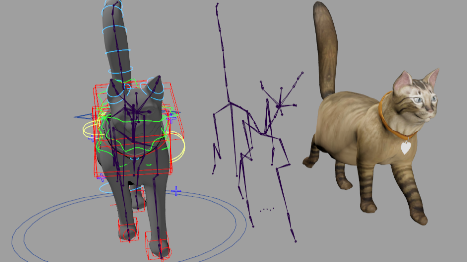
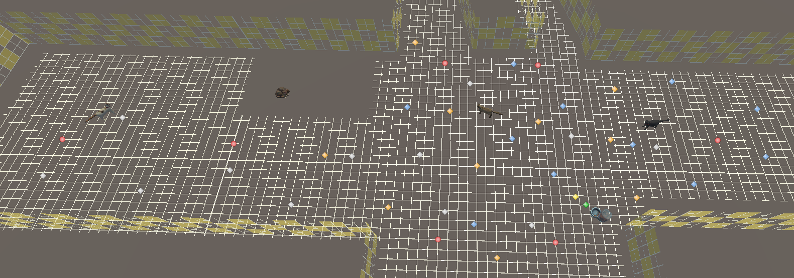

<iframe class="full aspect16-9" src="https://www.youtube.com/embed/nRpLaVBkLVs?autoplay=1&mute=1&loop=1&list=PLRNKKzTiLuHQl-WUGmUibhqL_UkyWO1yo" allowfullscreen></iframe>

Kitty City is an Augmented Reality Experience hosted by the [New Mexico Museum of Art - Vladem Contemporary](https://www.nmartmuseum.org/vladem-contemporary/){: target="_blank"} that is based on [Judy Chicago's Kitty City](https://judychicago.com/gallery/kitty-city/kc-artwork-2/). The project was designed using the Meta Quest Pro in Unity, and was developed in partnership with [Relevant VR](http://relevantvr.com/){: target="_blank"}.

 

The project was awarded a
[silver medal in the Davey Awards](https://daveyawards.com/winners-area/gallery/list/?search=relevantvr&event=1066&award=2){: target="_blank"}
in the Emerging Tech category for virtual and immersive experiences in augmented reality.

  

Additionally, it has been mentioned in the following:
- [The New York Times](https://www.nytimes.com/2023/10/19/arts/design/santa-fe-museum-vladem.html?unlocked_article_code=HjHbO4vTy72VSdmlsK3wxISNixs8BZ9m7BL7utkNj-qrZg09UjhRVDoeopTix5X5JkEz2x_I1JGSEzimfOv64v-c88xQYki8FbzvwO_QoyG9cEzyw1m9jhZMqDmQmu5xNQ7cXbhxJCWnsQNfAIzSs1aSaH8zUYCgF6clqVOqoNSxu25pNvgFWsoYEhzI3b0ZUOQnTwVGg2wLQvy27nJYSMuIpzEPVy9hAQdxWmFfSsmsXdmrlMGJMNnOjCnORBZARjYxMMUT0Fu9NhdarRizpZwdFtrSjiOt0QJOoQhkesB_jHcGplnSbwlgalsIEqawsmQIT8MhrYqJdgAnNPeqMNVIu4w&smid=url-share){: target="_blank"}
- [The Art Newspaper](https://www.theartnewspaper.com/2023/08/28/new-mexico-museum-expansion-vladem-contemporary){: target="_blank"}
- [Yahoo Travel and Leisure](https://www.yahoo.com/lifestyle/one-santa-fes-most-exciting-163726145.html?guccounter=1){: target="_blank"}

 

The cats were modeled, rigged, and animated by an external client and then setup in Unity using custom exporting tools for Autodesk Maya for handling the rig properly.

{: style="width:56.2%"}
{: style="width:43.3%"}

 

To make the cats able to walk around the room in augmented reality, a floor plan of the gallery had to be constructed and match to the real world. Spatial anchors were used to store the location of the gallery for the experience.

