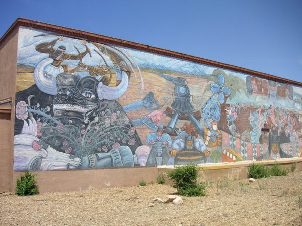

<iframe class="full aspect16-9" src="https://www.youtube.com/embed/V4Q-cZQh33c?autoplay=1&mute=1&loop=1&list=PLRNKKzTiLuHSUuXXtITI_tQJI0cNOAdWA" allowfullscreen></iframe>

The original Multi-cultural Mural was created in 1980 that honored the contributions made by different cultures to the history of New Mexico. The mural no longer exists, but at the same location there is a QR code that allows viewers to visualize the Multi-cultural through an augmented reality application on a smart device.

 

{: style="width:56.2%" }
{: style="width:42.2%" }

<i>Left: Augmented Reality Mural. Right: Original Mural</i>

